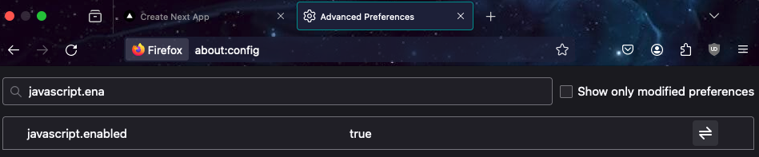
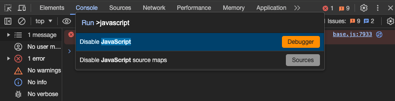

This is a [Next.js](https://nextjs.org/) project bootstrapped with [`create-next-app`](https://github.com/vercel/next.js/tree/canary/packages/create-next-app).

## Getting Started

First, run the development server:

```bash
npm run dev
# or
yarn dev
# or
pnpm dev
# or
bun dev
```

Open [http://localhost:3000](http://localhost:3000) with your browser to see the result.

You can start editing the page by modifying `app/page.tsx`. The page auto-updates as you edit the file.

This project uses [`next/font`](https://nextjs.org/docs/basic-features/font-optimization) to automatically optimize and load Inter, a custom Google Font.

## Learn More

To learn more about Next.js, take a look at the following resources:

- [Next.js Documentation](https://nextjs.org/docs) - learn about Next.js features and API.
- [Learn Next.js](https://nextjs.org/learn) - an interactive Next.js tutorial.

You can check out [the Next.js GitHub repository](https://github.com/vercel/next.js/) - your feedback and contributions are welcome!

## Info før du begynner

Info til de som ikke har brukt Next.js eller app directory tidligere. Er du kjent med Next så kan dette samt oppgavene bli kjedelige.. sorry 🤪 🤷‍♀️

Under mappen "app" finnes det en mappe per oppgave. I next er alle mapper under "app" en egen rute. Det vil si at dersom du vil se inneholdet i oppgave, må du gå inn på localhost:3000/oppgave. Da vil next automatisk vise deg innholdet i page.tsx under mappen oppgave. Mappen kan inneholde mange filer/komponenter men dersom de skal rendres på en spsefikk rute må komponenten være med i filen page.tsx eller barn av en komponent til den spesifikke ruten.

### Klient-komponenter / server-komponenter:

For å rendre en klientkomponent i Next og i React må du skrive "use client" øverst i filen. Da blir alt innhold i filen OG dens barn rendret på klient.
Det vil si at dersom du vil at noe skal rendres på server side må page.tsx innenfor en rute ikke inneholde "use client". Da blir innholdet rendret på server og du kan velge hvilke barn som skal rendres på klient dersom du vil kombinere dette.

[Les mer om klientkomponenter her](https://nextjs.org/docs/app/building-your-application/rendering/client-components)

TIPS: Apier som useState, useEffect eller onClick ( og alle event handlers) er ikke tilgengelige på server. Bruk av disse i filer som ikke er markert med "use client" vil føre til en feilmelding. Dersom deler av komponenten din er avhengig av dette så må du flytte de delene ut til en klientkomponent eller gjøre hele komponenten til en klientkomponent.

## Oppgaver

### Oppgave 1a

- Kjør appen
- Gå inn på localhost:3000/oppgave
- Trykk på knappen nederst på siden og se at teksten under dukker opp
- Skru dermed av javascript i nettleser:
  (How? Mac: command + shift + p,
  skriv javascript i feltet og velg "disable javascript")

  (Firefox:

  - Naviger til about:config i URL-feltet, godta risikoen og fortsett
  - Find javascript.enabled preferansen og toggle til den false)

  

  (Chrome:

  -Åpne Chrome DevTools

  - Deretter åpne command menu:
    - På MacOS, command + shift + P
    - På Window eller Linux, control + shift + p
  - Skriv javascript, trykk enter for å kjøre kommandoen.)

  

- Trykk på knappen igjen.
- Hva er anderledes og hvorfor?
- Bytt så ut ClientComponent med NoSSRClientComponent i page.tsx, hvordan og hvorfor blir denne annerledes med og uten javascript?

<details><summary>Løsningsforslag</summary>

Alt av html rendres uansett. Ingen endring. Dette er fordi Next prerendrer alt på server selv om det er en klientkompoenet og dermed skjer hydrering (js) på klienten.
Derfor funker det ikke å trykke på knappen uten javascript, men html vil likevel rendres på serverside. [Les mer om pre-rendering her](https://nextjs.org/learn-pages-router/basics/data-fetching/pre-rendering).

Dersom vi hadde hentet noe innhold dynamisk fra en server på klienten f.eks. ved bruk av useEffect og vist denne dataen ville ikke dataen vært synlig uten js og dermed ikke tilgjengelig for søkemotor heller. Alt utenom den dynamiske delen ville vært synlig. Men hadde vi hentet dataen på server ville alt vært synlig og tilgjengelig selv uten js.

</details>

### Oppgave 1b

- Bytt ut ClientComponent med ServerComponent i page.tsx. ServerComponent er en eksakt kopi av ClientComponent utenom "use client" som er fjernet for at den kun skal rendres på server.
- Gå til localhost:3000/oppgave og les feilmeldingen du får.

#### For å løse problemet kan du enten:

- 1: Legge på "use client" øverst i filen og rendre hele komponenten som en klientkomponent
- 2: Eller trekke knappen, useState og onClick ut i en egen komponent hvor du legger til "use client" men lar alt annet rendres på server. Du kan da fjerne knappen og tilhørende logikk i ServerComponent og importere Button.tsx i stedet.

#### Hva er forskjellen og ville en av delene ført til raskere sidelast?

<details><summary>Løsningsforslag</summary>

I Next vil alt (til og med klientkomponenter). prerendres på server uansett så det vil i praksis ikke ha noen betydning hvilken av valgene man tar (vel og merke dersom man ikke henter data fra en server). Men dersom man ikke bruker Next og en klientkomponent ikke hadde blitt rendret på server først, ville det gitt raskere sidelast dersom man rendret alt utenom knappen på server og kun knappen med onclick og state på klienten fordi js bundle blir da mindre / færre pakker å installere osv -> mindre jobb for klienten. I tillegg skal vi nå i oppgave 2 hente data på server og da er det lurt å la ServerComponent forbli på server og kun trekke ut knappen til en klientkomponent.

</details>

### Oppgave 1c

- Bytt ut med ClientComponent2 i page.tsx. Dette er en klientkomponent hvor html kun blir rendret dersom vi har mottatt data som blir hentet i en useEffect. Skru av js. Hvorfor synes ingenting?

<details><summary>Løsningsforslag</summary>

Selv om alt prerendres på server er det nå ingenting som kan vises fordi hele visningen avhenger av data som blir hentet i en useEffect som kun er tilgjengelig i nettleser etter at js er lastet ned og kjørt.

</details>

### Oppgave 2a:

1: Kommenter inn denne kodelinjen i ClientComponent:

```tsx
useEffect(() => {
  getData().then(setData)
}, [])
```

2: Gå til nettleser og se at data fra server dukker opp nederst på siden. Skru av javascript. Hva skjedde og hvorfor?

3: Søkemotoroptimalisering (SEO): Prøv å hente innholdet på siden med curl og se om slideshowobjektet er en del av responsen:

```bash
curl -X GET "http://localhost:3000/oppgave" -H "accept: application/json"
```

### Oppgave 2b:

1: Kommenter inn denne kodelinjen i ServerComponent (sørg for at koden blir rendret på server ved å fjerne "use client" dersom du har lagt til det):

```tsx
const data = await getData();

og dette nederst i return

{data && (
    <>
    <h2>Data fra server</h2>
    <ul>
        <li>Author: {data.author}</li>
        <li>Title: {data.title}</li>
    </ul>
    </>
)}
```

2: Gå til nettleser og se at data fra server dukker opp nederst på siden. Skru av javascript. Hva skjedde og hvorfor?

3: Søkemotoroptimalisering (SEO): Prøv å hente innholdet på siden med curl og se om slideshowobjektet er en del av responsen:

```bash
curl -X GET "http://localhost:3000/oppgave" -H "accept: application/json"
```
